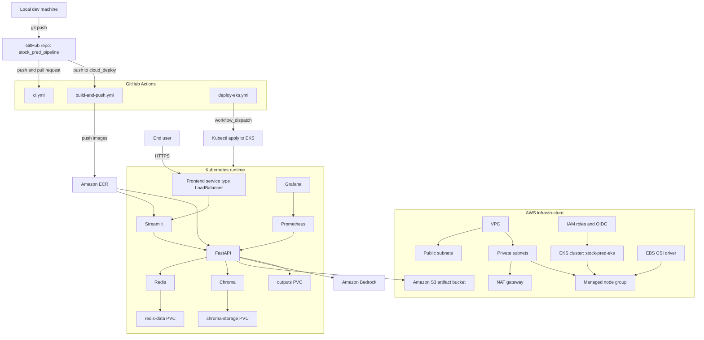

# AWS Cloud Deployment Notes

## What was Built

We turned the stock prediction project into a working AWS deployment path for `lanarkite99/stock_pred_pipeline` on the `cloud_deploy` branch.

The final stack uses:
- Amazon EKS for runtime
- Terraform for infrastructure
- Amazon ECR for images
- GitHub Actions for CI and CD
- Amazon Bedrock for chat and embeddings
- Redis inside the cluster for cache and task state
- Chroma inside the cluster for semantic recall
- Amazon S3 for artifacts
- EBS-backed Kubernetes PVCs for persistence

This became a practical project stack rather than a full enterprise platform. We kept the moving parts small enough to demo, test, and tear down quickly.

## Final Architecture

## What is Changed from the local setup

The main runtime shift was moving the AI pieces from local Ollama style dependencies to AWS Bedrock.

Key app changes:
- FastAPI now talks to Bedrock for model calls
- embeddings now use Bedrock embeddings
- the health endpoint checks Bedrock reachability instead of Ollama
- the forecast pipeline added sanity checks so impossible OHLC values get normalized before they hit the UI
- the training pipeline uses a chronological split instead of a random split
- validation checkpoint restoration was added so training returns the best model

Files that carried the biggest changes:
- `src/agents/agents.py`
- `src/agents/langgraph_wrapper.py`
- `src/inference.py`
- `src/memory/semantic_cache.py`
- `src/pipelines/train_pipeline.py`
- `src/model/training.py`
- `monitoring/health_checks.py`
- `backend/Dockerfile`

## Terraform and AWS Infrastructure

Terraform provisions the AWS side from the `terraform/` folder.

What we used:
- region: `ap-south-1`
- cluster name: `stock-pred-eks`
- ECR repositories for FastAPI, Streamlit, and monitoring
- an S3 artifact bucket
- EKS with a managed node group
- IAM roles for the nodes and for the EBS CSI driver
- EBS CSI instead of EFS, because it is simpler and cheaper for this project

What did not stay in the final setup:
- EFS

The first draft architecture assumed EFS for Chroma, but we moved to EBS PVCs.

## Kubernetes Layout

The deployed namespace is `stock-pred`.

The runtime components we actually used were:
- `frontend` as a `LoadBalancer` service
- `fastapi` as a `ClusterIP` service
- `redis` as a `ClusterIP` service
- `chroma` as a `ClusterIP` service
- `prometheus` as a `ClusterIP` service
- `grafana` as a `ClusterIP` service
- PVCs for outputs, Redis data, and Chroma storage

The manifests that mattered most were:
- `k8s/namespace.yaml`
- `k8s/volumes.yaml`
- `k8s/redis.yaml`
- `k8s/chroma.yaml`
- `k8s/fastapi.yaml`
- `k8s/frontend.yaml`
- `k8s/prometheus.yaml`
- `k8s/grafana.yaml`
- `k8s/secrets_example.yaml`
- `k8s/secrets.yaml` locally only, not committed

## GitHub Actions

We ended up with three workflows in `.github/workflows/`.

### `ci.yml`

This is the quick sanity workflow.

It runs on pushes and pull requests for the `cloud_deploy` branch.

### `build-and-push.yml`

This builds and pushes the Docker images to ECR.

I had to fix two things here:
- the Dockerfile path needed to point at `backend/Dockerfile` and `streamlit_app/Dockerfile`
- `feature_store/` had to be committed so the Docker build context could see it

### `deploy-eks.yml`

This applies the Kubernetes manifests to EKS.

I had to fix one deploy issue here too:
- the workflow needed to create the temp `k8s/` directory before writing the generated secret file

The deploy workflow also generates `k8s/secrets.generated.yaml` from GitHub Secrets, applies the manifests, and deletes the temp file afterward.

## GitHub OIDC and IAM

To let GitHub Actions deploy to AWS, a GitHub Actions role was created:
- `github-actions-deploy-role`

The role uses GitHub OIDC and is restricted to:
- repo: `lanarkite99/stock_pred_pipeline`
- branch: `cloud_deploy`

The IAM role ARN is what goes into GitHub Secrets as `AWS_GITHUB_ROLE_ARN`.

I also created the EKS access entry for that role and attached cluster admin access so the workflow can apply manifests to the cluster.

## Things I Had To Fix Along The Way

This project exposed a few real deployment issues, and I fixed them one by one.

### Docker build path

The first GitHub Actions build failed because Docker tried to use a root `Dockerfile` that did not exist.

Fix:
- point FastAPI build at `backend/Dockerfile`
- point Streamlit build at `streamlit_app/Dockerfile`

### Missing `feature_store/` in build context

The second build failed because the Dockerfile copied `feature_store/`, but that folder was not committed.

Fix:
- add `feature_store/` to Git so the workflow can see it

### Missing `k8s/` in deploy workflow

The first deploy run failed because the workflow tried to write `k8s/secrets.generated.yaml` before the directory existed.

Fix:
- create `k8s/` in the workflow before writing the temp secret file

### FastAPI image missing `monitoring/`

The FastAPI container initially broke in EKS because the Docker image did not include the `monitoring/` package.

Fix:
- add `COPY monitoring ./monitoring` in `backend/Dockerfile`

### Chroma CrashLoopBackOff

Chroma crashed because Kubernetes service environment variables were being injected into the container and Chroma interpreted one of them as its own config.

Fix:
- disable service links in the Chroma pod
- mount the PVC at the Chroma data path

### Bedrock credentials in the pod

`analyze` failed at first because the FastAPI pod did not have AWS credentials available for Bedrock.

Fix:
- add the AWS credentials to the Kubernetes secret for the demo run

### Forecasts that were not physically plausible

Some forecasts were wildly off in absolute price level and could even produce invalid OHLC ordering.

Fix:
- normalize forecast rows after inverse scaling
- clamp the OHLC values so they stay physically valid
- add a sanity check block to the forecast output

## What I Learned From The Model Outputs

The model can look healthy in validation and still be badly calibrated in live price space.

We saw:
- negative R2 on some runs
- forecasts that were far below the real market price
- market regime shifts that the monitor correctly flagged as warning or critical

That pointed to a calibration problem, not just a deployment issue.

The most honest read is:
- the system works end to end
- the cloud deployment works
- some ticker forecasts are still unreliable and need better calibration or retraining

## Demo Results

During the AWS run, the following was verified:
- the frontend public URL opened successfully
- `Train Child` worked after the parent model was trained
- `Predict` worked
- `Analyze` worked after Bedrock credentials were available in the pod
- `Monitor` worked and surfaced regime drift correctly
- `kubectl get pods` showed the app components running

The main public endpoint was the frontend LoadBalancer service.

## Cleanup and Teardown

This deployment was designed to be temporary.

We created cleanup scripts so the whole stack could be removed safely:
- `scripts/aws_plan.ps1`
- `scripts/aws_apply.ps1`
- `scripts/aws_destroy.ps1`

The destroy flow handled:
- ECR cleanup
- Kubernetes cleanup
- Terraform destroy
- final AWS checks for leftovers

IAM users and roles were left in place because they do not cost money by themselves. The billable parts were the active cloud resources, not the identity objects.

## Current Status

The cloud deployment has been built, tested, debugged, and torn down cleanly.

The important thing is that we now have a working reference path for:
- local development
- AWS infrastructure provisioning
- image build and push
- EKS deployment
- Bedrock integration
- teardown and cleanup

## Files Worth Looking At

If you want the shortest route back into this setup, start with these files:
- `.github/workflows/ci.yml`
- `.github/workflows/build-and-push.yml`
- `.github/workflows/deploy-eks.yml`
- `terraform/terraform.tfvars`
- `terraform/eks.tf`
- `terraform/iam.tf`
- `k8s/volumes.yaml`
- `k8s/chroma.yaml`
- `k8s/fastapi.yaml`
- `k8s/frontend.yaml`
- `backend/Dockerfile`
- `src/agents/agents.py`
- `src/agents/langgraph_wrapper.py`
- `src/inference.py`
- `monitoring/health_checks.py`

## Short Version

This project now has a real AWS deployment path:
- GitHub pushes to `cloud_deploy`
- GitHub Actions builds images and pushes to ECR
- Terraform provisions EKS and supporting AWS services
- Kubernetes runs the app in `stock-pred`
- Bedrock handles LLM and embedding calls
- Redis and Chroma run in-cluster
- S3 stores durable artifacts
- EBS backs the persistent volumes
- the whole stack can be destroyed when the demo is done
