# System Design

## 1. Executive Summary

`Stock Pred Pipeline` is an end-to-end stock prediction and analysis system built around a FastAPI backend, PyTorch-based parent/child models, Ollama-backed agentic analysis, Redis exact-cache, Chroma semantic cache, custom monitoring, and a Streamlit dashboard.

The repository currently supports:

- parent model training
- child model training per ticker
- prediction serving with Redis cache
- stock analysis with a LangGraph-based agent flow
- per-ticker monitoring with saved JSON artifacts
- system observability through Prometheus and Grafana
- optional DagsHub-backed MLflow tracking
- a lightweight Streamlit UI for train / predict / analyze / monitor flows

This document describes the **implemented** design in this repository. It does not assume cloud deployment, Kubernetes, Evidently-based reports, or unimplemented search/discovery features which is the next phase.

---

## 2. Goals and Scope

### 2.1 Functional goals

The current system is designed to:

- train a reusable parent market model
- fine-tune child models for specific tickers
- serve short-horizon stock forecasts
- generate natural-language stock reports from predictions and news
- reuse prior analysis through semantic caching
- track experiments and artifacts
- expose operational and application metrics
- summarize ticker-level health through monitoring outputs

### 2.2 Explicitly in scope today

- FastAPI backend
- Streamlit UI
- Redis exact-cache and task state
- Feast configuration and local registry
- PyTorch training and inference
- LangGraph analysis orchestration
- Ollama LLM + embeddings
- Chroma semantic cache
- Prometheus + Grafana
- MLflow + optional DagsHub integration
- JSON artifacts in `outputs/`

### 2.3 Next Phase (explicitly not assumed in this doc)

- public cloud infrastructure (AWS)
- Kubernetes deployment for this repo
- Evidently drift reports
- production auth / RBAC
- ticker autocomplete / ticker search service
- a separate React/Vue frontend

---

## 3. High-Level Design

### 3.1 Component map

```mermaid
flowchart TD
    U[User] --> S[Streamlit App]
    U --> F[FastAPI API]

    S --> F

    subgraph Serving Layer
        F --> TR[Training Endpoints]
        F --> PR[Prediction Endpoints]
        F --> AN[Analysis Endpoint]
        F --> MO[Monitoring Endpoint]
        F --> MT[/metrics]
    end

    subgraph ML Layer
        TR --> FS[Feast Feature Store]
        TR --> PT[PyTorch Training]
        PR --> IF[Inference Pipeline]
        PT --> ART[Model Artifacts]
        IF --> ART
    end

    subgraph Agent Layer
        AN --> LG[LangGraph Flow]
        LG --> OL[Ollama LLM]
        LG --> OE[Ollama Embeddings]
        LG --> NEWS[News Retrieval]
        NEWS --> FH[Finnhub]
        NEWS --> NA[NewsAPI]
        NEWS --> YF[Yahoo Finance]
    end

    subgraph Cache and State
        F --> R[Redis]
        AN --> C[Chroma Semantic Cache]
        MO --> R
    end

    subgraph Monitoring and Observability
        MT --> PM[Prometheus]
        PM --> GR[Grafana]
        MO --> MON[Custom Monitoring Runner]
        MON --> REG[Regime Assessment]
        MON --> QL[Analysis Quality Checks]
    end

    subgraph Experiment Tracking
        TR --> ML[MLflow]
        ML --> DH[DagsHub]
    end

    subgraph Storage
        ART --> OUT[outputs/<ticker>/...]
        LG --> LA[latest_analysis.json]
        MON --> LM[latest_monitor.json]
        LA --> OUT
        LM --> OUT
        C --> VDB[outputs/vector_db]
    end
```

### 3.2 Runtime responsibilities

| Layer | Components | Responsibility |
|---|---|---|
| UI | Streamlit | Trigger API actions and render saved outputs |
| API | FastAPI | Route requests, orchestrate training/prediction/analysis/monitoring |
| ML | Feast, PyTorch pipelines | Build features, train models, run inference |
| AI | LangGraph, Ollama, news fetchers | Generate natural-language analysis from prediction + news |
| State | Redis, Chroma | Exact-cache, task state, semantic cache |
| Observability | Prometheus, Grafana, monitoring package | Metrics, dashboards, ticker-level health summaries |
| Tracking | MLflow, DagsHub | Experiment logging and artifact lineage |
| Storage | outputs/, feature_store/, mlruns/ | Models, JSON reports, registry, local artifacts |

### 3.3 Main interfaces

1. User to Streamlit
- manual train / predict / analyze / monitor actions
- display of saved analysis and monitoring artifacts

2. Streamlit to FastAPI
- HTTP requests for live operations

3. FastAPI to Redis
- cache reads/writes
- task status tracking

4. FastAPI to model pipelines
- training and inference execution

5. FastAPI to analysis layer
- stock analysis orchestration via `analyze_stock()`

6. FastAPI to Prometheus
- exposes `/metrics`

7. Training pipeline to MLflow
- logs parameters, metrics, and artifacts

### 3.4 Main data flow

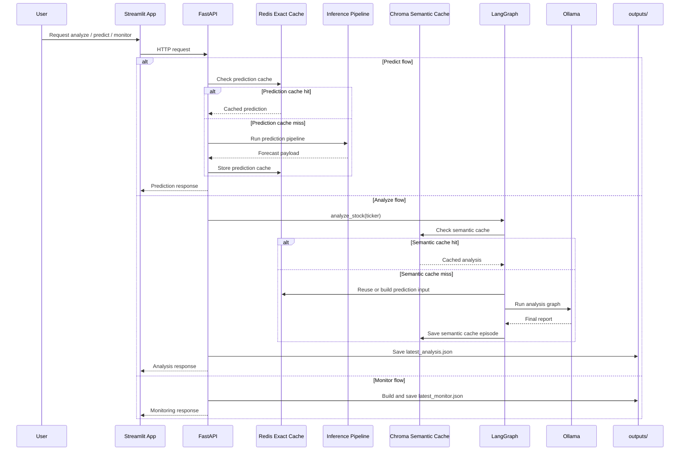

This is the main end-to-end request flow currently implemented in the repo. It focuses on the active runtime path rather than the older aspirational architecture.

---

## 4. Deployment View

### 4.1 Docker Compose topology

The current `docker-compose.yml` defines these services:

- `fastapi`
- `redis`
- `prometheus`
- `grafana`
- `streamlit_app`

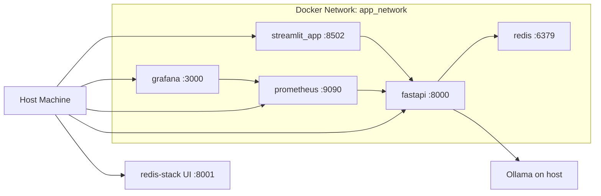

### 4.2 Current runtime assumptions

- FastAPI is containerized.
- Redis is containerized.
- Prometheus and Grafana are containerized.
- Streamlit is containerized and communicates with FastAPI via the Docker network.
- Ollama runs on the host and is accessed from FastAPI via `OLLAMA_BASE_URL`.

### 4.3 Current service URLs

- FastAPI: `http://localhost:8000`
- FastAPI docs: `http://localhost:8000/docs`
- Prometheus: `http://localhost:9090`
- Grafana: `http://localhost:3000`
- Streamlit: `http://localhost:8502`
- Redis Stack UI: `http://localhost:8001`

---

## 5. Backend Design

### 5.1 FastAPI application

Relevant file:

- `backend/main.py`

Implemented responsibilities:

- initialize output directories
- initialize MLflow / DagsHub integration
- establish Redis connection during app startup
- publish Prometheus metrics at `/metrics`
- instrument FastAPI routes via `prometheus_fastapi_instrumentator`
- register routes from `backend/api_endpoints.py`

Current runtime detail:

- FastAPI runs with one worker
- this is important because custom Prometheus metrics are held in-process

### 5.2 API endpoints

Relevant file:

- `backend/api_endpoints.py`

Implemented endpoints:

- `GET /`
- `GET /health`
- `GET /status/{task_id}`
- `POST /train-parent`
- `POST /train-child`
- `POST /predict-parent`
- `POST /predict-child`
- `POST /analyze`
- `POST /monitor/{ticker}`

### 5.3 API behavior patterns

#### Async task pattern

Training endpoints write task status into Redis and return early.

#### Exact-cache pattern

Prediction endpoints use Redis through `get_or_set_cache(...)`.

#### Auto-train pattern

If a model artifact is missing during predict/analyze, the backend can start training and return a `training` response.

#### Artifact-save pattern

- `/analyze` writes `outputs/<ticker>/latest_analysis.json`
- `/monitor/{ticker}` writes `outputs/<ticker>/monitor/latest_monitor.json`

---

## 6. ML Pipeline Design

### 6.1 Configuration

Relevant file:

- `src/config.py`

Current defaults include:

- parent ticker: `^NSEI`
- context length: `60`
- prediction horizon: `5`
- features:
  - `Open`
  - `High`
  - `Low`
  - `Close`
  - `Volume`
  - `RSI`
  - `MACD`
- device chosen dynamically from CUDA/CPU
- parent artifacts under `outputs/parent`
- general output root `outputs`

### 6.2 Feature store

Relevant files:

- `feature_store/feature_store.yaml`
- `feature_store/features.py`

Current explicit config in `feature_store.yaml`:

- `project: stock_prediction`
- `provider: local`
- `registry: data/registry.db`

This repo includes a local Feast registry and feature-store directory. This design doc does not claim extra online-store behavior beyond explicit configuration.

### 6.3 Data pipeline flow

Relevant areas:

- `src/data/...`
- `feature_store/...`
- `src/pipelines/...`

At a high level, the current repo follows this data path:

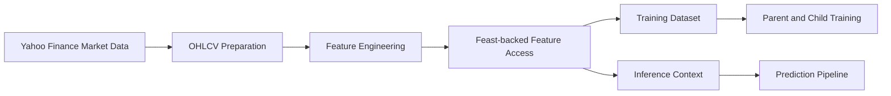

This is intentionally high-level because the document only describes the feature-store and pipeline behavior that is clearly present in the repo.

### 6.4 Training architecture

Relevant area:

- `src/pipelines/train_pipeline.py`

The current system follows a parent/child structure:

1. Parent model
- trained on a broad market ticker
- provides a reusable starting point

2. Child model
- trained for a specific stock ticker
- uses transfer learning from the parent model

### 6.5 Transfer learning architecture

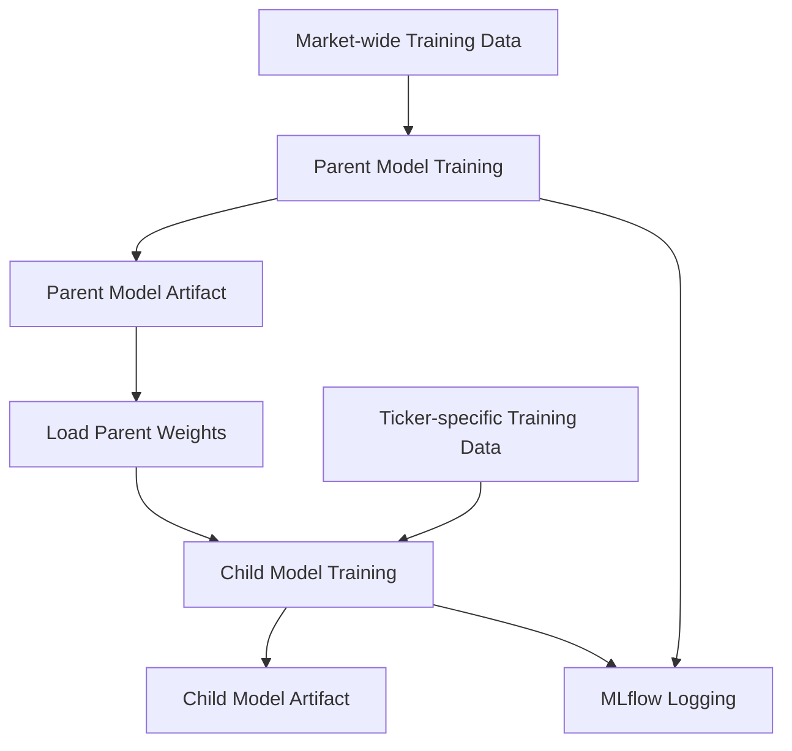

The current repo supports the parent-to-child training pattern. This document does not claim a more detailed freeze/fine-tune strategy unless explicitly visible in code.

### 6.6 Training pipeline flow

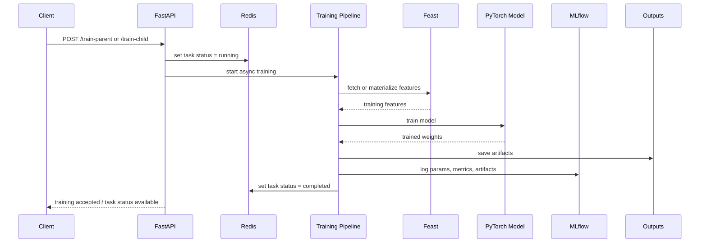

### 6.7 Inference architecture

Relevant area:

- `src/pipelines/inference_pipeline.py`

Inference behavior in the current system:

- load model artifacts
- fetch current feature context
- generate a short-horizon forecast
- cache the result in Redis
- return prediction payload including recent history and forecast window

### 6.8 Inference pipeline flow

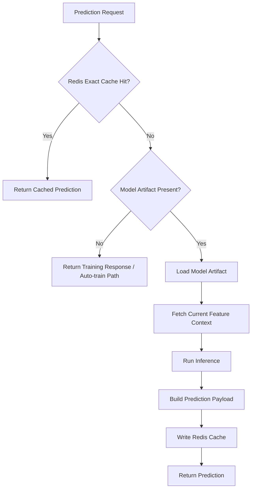

### 6.9 ML flow diagram

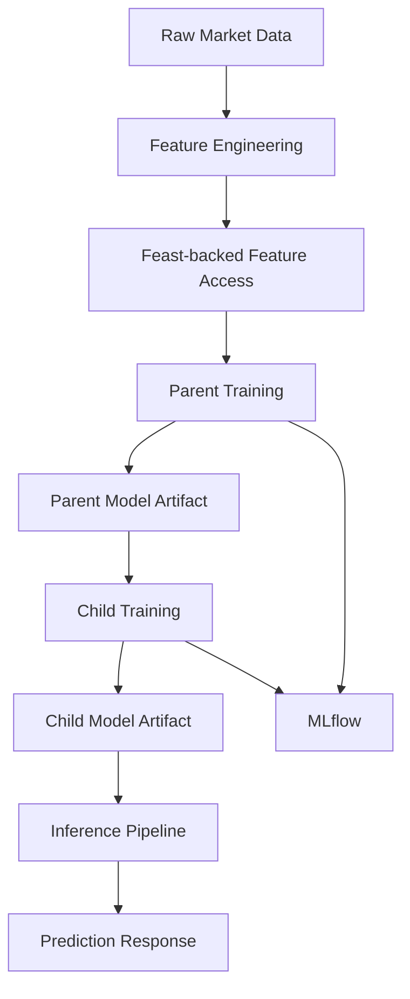

---

## 7. Agentic Analysis Design

### 7.1 Current orchestration

Relevant file:

- `src/agents/langgraph_wrapper.py`

Implemented graph today:

- `perf` node
- `report` node


### 7.2 Current active agent roles

Relevant file:

- `src/agents/agents.py`

Active analysis flow currently uses:

1. Performance analyst
- interprets forecast data
- extracts direction and trading summary

2. Report generator
- combines forecast signal and news context
- produces final recommendation and confidence

### 7.3 Analysis data sources

Relevant file:

- `src/agents/fetch.py`

Analysis uses two major inputs:

1. Prediction data
- fetched from the prediction path
- benefits from Redis exact-cache

2. News data
- `.NS` tickers prefer NewsAPI first
- other tickers attempt Finnhub first
- fallback behavior includes Yahoo/yfinance sources where available

### 7.4 Analysis sequence

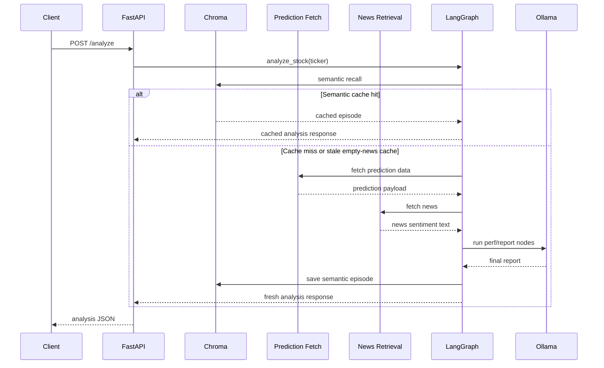

### 7.5 Ollama execution flow

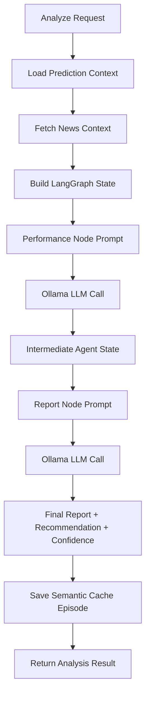

This reflects the current two-node analysis flow. It does not assume the older four-agent orchestration from the reference document.

### 7.6 Semantic cache design

Relevant file:

- `src/memory/semantic_cache.py`

Current implementation details:

- backend store: Chroma persistent client
- path: `outputs/vector_db`
- collection: `analysis_cache`
- stores:
  - summary
  - final report
  - recommendation
  - confidence
  - prediction JSON
  - news sentiment
  - llm model
  - embed model
  - news_empty
  - thread metadata
  - timestamp metadata

Special logic currently implemented:

- cached `.NS` analysis with empty news is treated as stale and refreshed instead of always reused

---

## 8. Caching and State Design

### 8.1 Redis responsibilities

Relevant files:

- `backend/tasks.py`
- `backend/state.py`

Redis is used for:

1. Exact-cache
- prediction cache keys such as `predict_child:<ticker>`

2. Async task state
- task status keys such as `task_status:<task_id>`

3. backend health integration
- Redis availability reflected in system metrics and health checks

### 8.2 Chroma responsibilities

Chroma is used for:

- semantic recall of prior analysis for the same ticker
- persistence of analysis episodes

### 8.3 Cache/state diagram

```mermaid
flowchart LR
    A[Prediction Request] --> R[Redis Exact Cache]
    R -->|Hit| P1[Return Cached Prediction]
    R -->|Miss| P2[Run Inference]
    P2 --> R

    B[Analysis Request] --> C[Chroma Semantic Cache]
    C -->|Hit| A1[Return Cached Analysis]
    C -->|Miss| A2[Rebuild Analysis]
    A2 --> C

    T[Training Request] --> TS[Redis Task State]
    TS --> ST[GET /status/{task_id}]
```

---

## 9. Monitoring and Observability Design

### 9.1 Metrics monitoring

Relevant files:

- `backend/state.py`
- `backend/main.py`
- `prometheus/prometheus.yml`
- `grafana/...`

Current observability stack:

- FastAPI exposes `/metrics`
- Prometheus scrapes `/metrics`
- Grafana visualizes Prometheus metrics

### 9.2 Custom Prometheus metrics

Metrics currently defined include categories such as:

- system CPU / RAM / disk
- Redis status and key count
- training status and duration
- prediction counters and latency
- cache hit / miss counters
- analysis counters, failures, and latency
- analysis cache hit / miss counters

### 9.3 Custom ticker monitoring

Relevant files:

- `monitoring/health_checks.py`
- `monitoring/regime.py`
- `monitoring/response_quality.py`
- `monitoring/run_monitoring.py`

The ticker-level monitoring flow currently computes:

1. System health
- Redis reachable
- Ollama reachable
- prediction cache available
- semantic cache available

2. Regime assessment
- reference and current windows from Yahoo Finance data
- metrics:
  - `return_drift_score`
  - `volatility_ratio`
  - `volume_shift_score`
  - `price_range_shift_score`

3. Analysis quality
- whether analysis ran
- recommendation validity
- confidence validity
- forecast grounding
- stance consistency
- news honesty
- report non-emptiness

### 9.4 Monitoring sequence

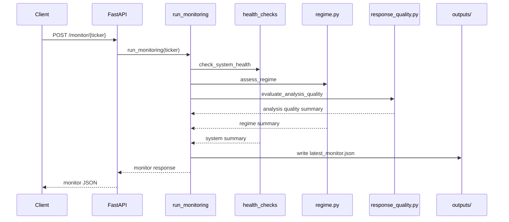

### 9.5 Drift flow

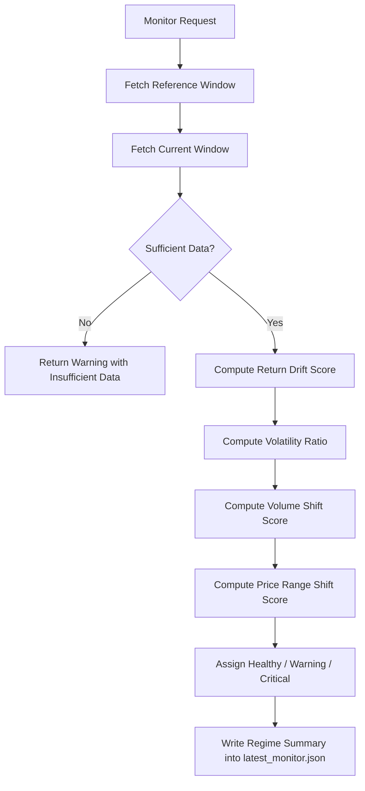

This reflects the current custom regime assessment in `monitoring/regime.py`, which compares recent and reference OHLCV windows and derives heuristic drift metrics.

---

## 10. Streamlit Dashboard Design

### 10.1 Current role

Relevant file:

- `streamlit_app/app.py`

The Streamlit app currently serves as a thin operational dashboard.

It allows users to:

- trigger child training
- trigger prediction
- trigger analysis
- trigger monitoring
- check training task status
- inspect saved `latest_analysis.json`
- inspect saved `latest_monitor.json`
- view forecast chart/table
- view monitor summary tables

### 10.2 Current data access pattern

The dashboard uses two sources:

1. Live API access
- FastAPI endpoints for active operations

2. Local artifact reads
- `outputs/<ticker>/latest_analysis.json`
- `outputs/<ticker>/monitor/latest_monitor.json`

This means the Streamlit UI is not a standalone full system by itself. It depends on backend services for live actions.

---

## 11. Experiment Tracking Design

### 11.1 Current implementation

Relevant file:

- `src/utils.py`

Current behavior:

- loads env vars through `.env`
- initializes DagsHub if repo/user vars are provided
- sets MLflow tracking URI
- sets MLflow registry URI to the same tracking URI when possible
- configures MLflow auth via DagsHub token if available

### 11.2 Actual scope in this repo

Experiment tracking is primarily tied to training flows.
This design doc does not claim a separate deployment pipeline or model promotion workflow beyond MLflow logging and artifact storage.

---

## 12. Artifact and Storage Design

### 12.1 Output conventions

Current important artifact paths include:

- `outputs/<ticker>/latest_analysis.json`
- `outputs/<ticker>/monitor/latest_monitor.json`
- model and training summary files under `outputs/<ticker>/...`
- semantic cache under `outputs/vector_db`

### 12.2 Other persisted data

- Feast registry under `feature_store/data/registry.db`
- local MLflow files under project-local paths when used
- Redis Docker volume
- Grafana Docker volume

### 12.3 Artifact flow

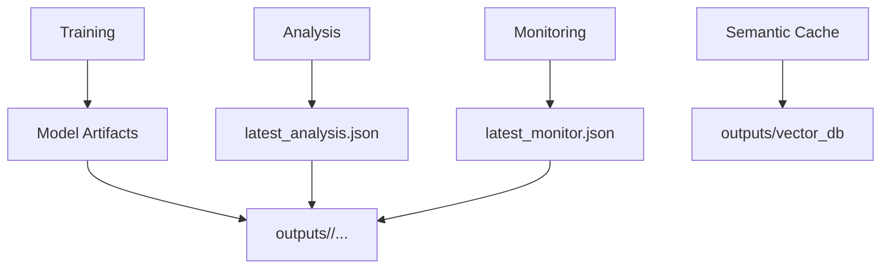

---

## 13. API Data Flow Details

### 13.1 Train child flow

1. request hits `POST /train-child`
2. backend checks Redis task state
3. if not already running, async training starts
4. task status is saved in Redis
5. training artifacts are written under `outputs/`
6. MLflow may log the run

### 13.2 Predict child flow

1. request hits `POST /predict-child`
2. backend checks Redis exact-cache
3. on miss, inference runs
4. result is cached and returned
5. on missing model artifacts, auto-training can be triggered

### 13.3 Analyze flow

1. request hits `POST /analyze`
2. semantic cache is queried
3. if cache is valid, cached analysis is returned
4. otherwise prediction + news are fetched
5. LangGraph/Ollama produce analysis
6. result is saved to `latest_analysis.json`
7. semantic cache is updated

### 13.4 Monitor flow

1. request hits `POST /monitor/{ticker}`
2. system health, regime, and analysis quality checks are run
3. result is saved to `latest_monitor.json`
4. result is returned to client

---

## 14. Performance Metrics

### 14.1 Local baseline measurements

The following numbers were measured on the current local setup without adding benchmark-specific code. They reflect a single-machine run with Docker Compose services, host Ollama, Redis cache and Chroma semantic cache.

| Operation | Measurement | Notes |
|---|---:|---|
| `POST /train-child` request acceptance | `2.71 s` | time for API to accept and enqueue the training task |
| Child training actual duration | `151 s` | measured from `start_time=2026-04-01 10:44:13` to `completed_at=2026-04-01 10:46:44` |
| `POST /predict-child` fresh call | `5.64 s` | first prediction call after training |
| `POST /predict-child` cached call | `0.39 s` | second call served through Redis exact-cache |
| `POST /analyze` fresh call | `45.70 s` | full analysis path with prediction + news + Ollama generation |
| `POST /analyze` semantic-cache hit | `1.59 s` | repeated call with `metadata.source_cache = semantic_cache` |
| `POST /monitor/{ticker}` | `3.47 s` | monitor run for the same ticker |

### 14.2 Interpretation

These measurements show the two main cache layers working as intended:

- Redis exact-cache reduces prediction latency from about `5.64 s` to about `0.39 s`.
- Chroma semantic cache reduces analysis latency from about `45.70 s` to about `1.59 s`.
- Child training remains a minutes-scale operation rather than a request/response operation.
- Monitoring is materially lighter than a fresh analysis run because it reuses saved artifacts and cache-backed analysis where available.

### 14.3 Measurement notes

The values above were collected using a new ticker, `ICICIBANK.NS`, to avoid contamination from previously cached prediction and analysis results.

The measurement method used was:

- `Measure-Command` around API calls for request latency
- `GET /status/{task_id}` timestamps for actual child-training duration
- repeat calls to distinguish fresh vs cached behavior

These values should be treated as **local baseline measurements**, not production SLOs or cloud-scale guarantees.

## 15. Current Limitations and Operational Notes

### 15.1 Known design characteristics

- FastAPI intentionally runs with one worker for metric consistency.
- `GET /status/{task_id}` is only for async training task state.
- `POST /train-child` can start another training run after prior completion.
- monitoring outputs are heuristic signals, not automatic retrain decisions.
- Streamlit live actions depend on FastAPI being reachable.


## 16. Recommended code reading order

For someone trying to understand the implementation, a practical order is:

1. `README.md`
2. `docker-compose.yml`
3. `backend/main.py`
4. `backend/api_endpoints.py`
5. `backend/state.py`
6. `backend/tasks.py`
7. `src/config.py`
8. `src/pipelines/...`
9. `src/agents/langgraph_wrapper.py`
10. `src/agents/fetch.py`
11. `src/memory/semantic_cache.py`
12. `monitoring/...`
13. `streamlit_app/app.py`

