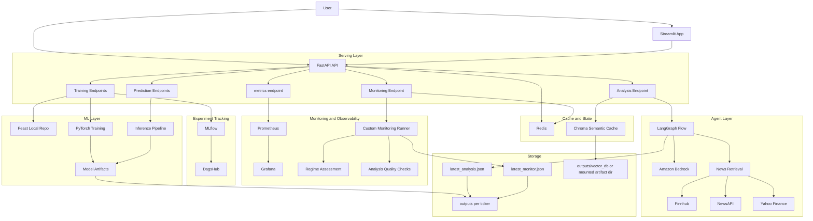
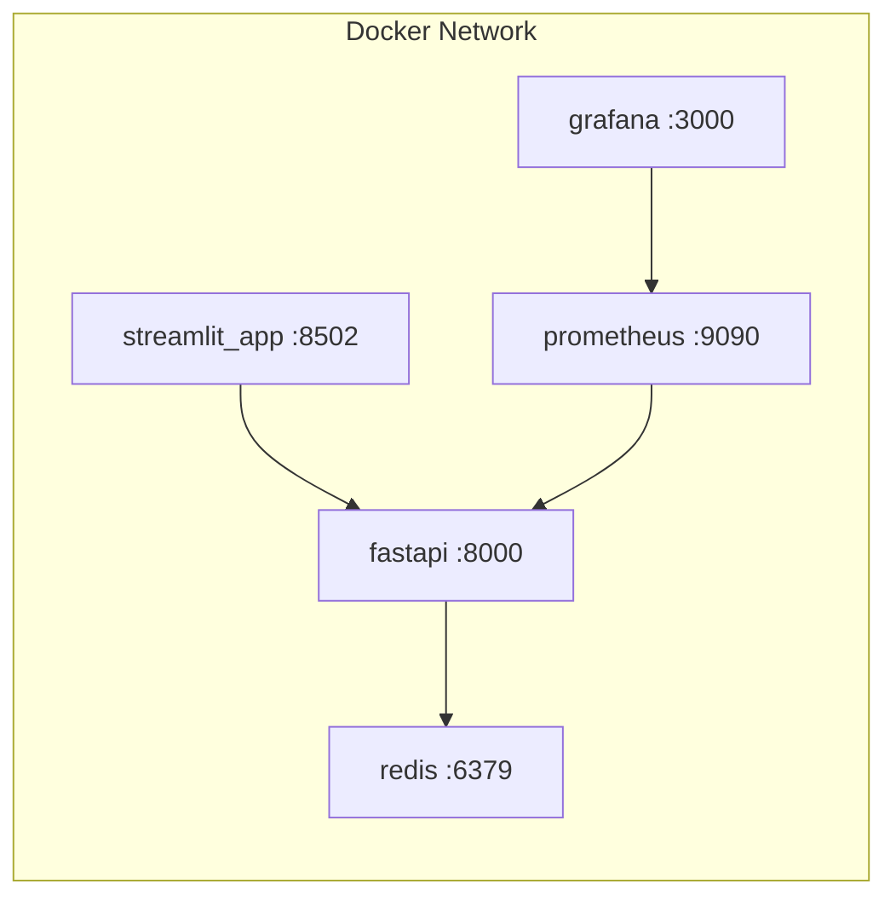
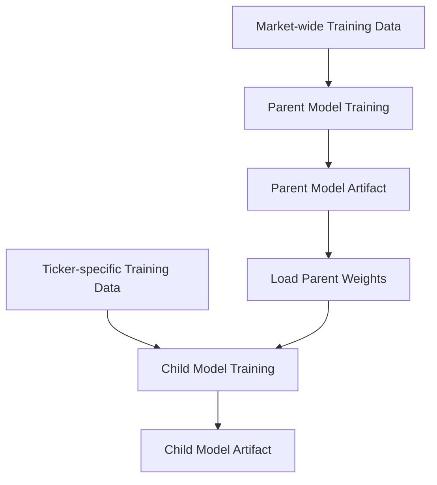

# System Design

## 1. Executive Summary

`Stock Pred Pipeline` is an end-to-end stock prediction and analysis system built around a FastAPI backend, PyTorch parent/child LSTM models, Bedrock-backed agentic analysis, Redis exact cache, Chroma semantic cache, custom monitoring, Prometheus/Grafana observability, Feast-backed feature access, and a Streamlit dashboard.

The repository currently supports:

- parent model training
- child model training per ticker
- prediction serving with Redis cache
- stock analysis with a LangGraph-based agent flow
- per-ticker monitoring with saved JSON artifacts
- system observability through Prometheus and Grafana
- optional DagsHub-backed MLflow tracking
- local Docker Compose workflows and AWS/EKS deployment assets

This document describes the implemented design in this repository. It does not assume extra components that are not present in code.

---

## 2. Goals and Scope

### 2.1 Functional goals

The system is designed to:

- train a reusable parent market model
- adapt child models for specific tickers
- serve short-horizon stock forecasts
- generate natural-language stock reports from predictions and news
- reuse prior analysis through semantic caching
- track experiments and artifacts
- expose operational and application metrics
- summarize ticker-level health through monitoring outputs

### 2.2 In scope today

- FastAPI backend
- Streamlit UI
- Redis exact cache and task state
- Feast configuration and local registry/data
- PyTorch training and inference
- LangGraph analysis orchestration
- Amazon Bedrock chat + embeddings
- Chroma semantic cache
- Prometheus + Grafana
- MLflow + optional DagsHub integration
- JSON artifacts in `outputs/`
- Kubernetes / Terraform deployment assets

### 2.3 Not claimed as fully production-hardened

- auth / RBAC
- durable distributed task queue
- comprehensive automated test suite
- managed cloud-native feature platform
- strict artifact version enforcement
- advanced drift tooling such as Evidently

---

## 3. High-Level Design

### 3.1 Component map

### 3.2 Runtime responsibilities

| Layer | Components | Responsibility |
|---|---|---|
| UI | Streamlit | Trigger API actions and render saved outputs |
| API | FastAPI | Route requests, orchestrate training/prediction/analysis/monitoring, apply basic rate limiting |
| ML | Feast, PyTorch pipelines | Build features, train models, run inference |
| AI | LangGraph, Bedrock, news fetchers | Generate natural-language analysis from prediction + news |
| State | Redis, Chroma | Exact cache, task state, semantic cache |
| Observability | Prometheus, Grafana, monitoring package | Metrics, dashboards, ticker-level health summaries |
| Tracking | MLflow, DagsHub | Experiment logging and artifact lineage |
| Storage | outputs/, feature_store/, mlruns/ | Models, JSON reports, registry, local artifacts |

---

## 4. Main Runtime Flows

### 4.1 Training flow

1. request hits `POST /train-parent` or `POST /train-child`
2. FastAPI writes running status to Redis
3. training is offloaded to the shared executor
4. `fetch_ohlcv(...)` downloads data and refreshes Feast local files
5. chronological train/validation loaders are built
6. model trains through the PyTorch loop
7. model, scaler, and summary artifacts are saved under `outputs/`
8. MLflow logs params, metrics, and artifacts where configured
9. Redis task status is updated to `completed` or `failed`

### 4.2 Prediction flow

1. request hits `POST /predict-parent` or `POST /predict-child`
2. FastAPI checks Redis exact cache
3. on miss, inference loads model + scaler from artifacts
4. current data is fetched again through `fetch_ohlcv(...)`
5. Feast online features are accessed if available
6. forecast is generated and normalized for OHLC consistency
7. prediction result is cached in Redis and returned

### 4.3 Analysis flow

1. request hits `POST /analyze`
2. semantic cache is queried in Chroma
3. if no valid hit is found, prediction data is fetched
4. recent news is fetched from NewsAPI / Finnhub / Yahoo fallback
5. LangGraph runs `perf` then `report`
6. Bedrock generates the narrative output
7. analysis is saved to latest artifact JSON and semantic cache
8. response is returned to the client

### 4.4 Monitoring flow

1. request hits `POST /monitor/{ticker}`
2. system health checks Redis, Bedrock, and cache availability
3. regime assessment compares recent vs reference market windows
4. analysis quality checks inspect grounding and stance consistency
5. result is written to `outputs/<ticker>/monitor/latest_monitor.json`
6. monitoring JSON is returned

---

## 5. Deployment View

### 5.1 Local deployment

The current `docker-compose.yml` defines these services:

- `fastapi`
- `redis`
- `prometheus`
- `grafana`
- `streamlit_app`

### 5.2 Cloud deployment assets

The repo also contains:

- Kubernetes manifests under [k8s](/d:/python/stock_pred_pipeline/k8s)
- Terraform infrastructure under [terraform](/d:/python/stock_pred_pipeline/terraform)
- GitHub Actions workflows under [.github/workflows](/d:/python/stock_pred_pipeline/.github/workflows)

Current cloud-oriented storage behavior in manifests and code:

- FastAPI can place artifacts under `ARTIFACT_DIR`
- `/app/outputs` is mounted to a PVC in EKS
- Prometheus and Grafana now have PVC-backed persistence in manifests
- Feast remains a local repo from the app’s point of view, but its `feature_store/data` path can be mounted to persistent storage
- `FEAST_ONLINE_STORE=redis` enables a Redis online store while keeping local registry/offline files

---

## 6. Feature and Data Design

### 6.1 Feature set

Current default features from [config.py](/d:/python/stock_pred_pipeline/src/config.py):

- `Open`
- `High`
- `Low`
- `Close`
- `Volume`
- `RSI`
- `MACD`

### 6.2 Feast design

Relevant paths:

- [feature_store/feature_store.yaml](/d:/python/stock_pred_pipeline/feature_store/feature_store.yaml)
- [ingestion.py](/d:/python/stock_pred_pipeline/src/data/ingestion.py)
- [inference_pipeline.py](/d:/python/stock_pred_pipeline/src/pipelines/inference_pipeline.py)

Implemented behavior:

- Feast repo path is local to the application
- registry and offline files live under `feature_store/data`
- online serving can be configured as `sqlite` or `redis`
- the repo writes config dynamically based on `FEAST_ONLINE_STORE`

So the current design is not “Feast on S3.” It is a hybrid of:
- local repo / registry / offline data
- optional Redis online serving

### 6.3 Data preparation and validation

Implemented in [ingestion.py](/d:/python/stock_pred_pipeline/src/data/ingestion.py) and [preparation.py](/d:/python/stock_pred_pipeline/src/data/preparation.py):

- pull daily OHLCV from Yahoo Finance
- compute RSI and MACD
- validate schema, order, and minimum rows
- drop rows with missing required values
- fit `StandardScaler` on the chronological training partition only
- generate rolling context/future windows

### 6.4 Outlier visibility

Training summaries now include simple IQR-based outlier counts per feature plus total rows with any detected outlier, computed in [train_pipeline.py](/d:/python/stock_pred_pipeline/src/pipelines/train_pipeline.py).

This is observability for outliers, not full outlier treatment.

---

## 7. Model Design

### 7.1 Architecture

The implemented forecasting model is `StockLSTM` in [definition.py](/d:/python/stock_pred_pipeline/src/model/definition.py).

This repo does not currently implement a Transformer-based forecaster.

### 7.2 Parent-child transfer flow

Current child adaptation modes:

- `freeze`
- `fine_tune`

### 7.3 Inference safeguards

Inference in [inference.py](/d:/python/stock_pred_pipeline/src/inference.py) applies forecast sanity normalization so returned OHLC rows remain physically consistent.

That includes:

- correcting swapped high/low order
- clamping open/close into the final `[low, high]` range
- ensuring volume is non-negative

---

## 8. Agentic Analysis Design

### 8.1 Current graph

The active graph in [langgraph_wrapper.py](/d:/python/stock_pred_pipeline/src/agents/langgraph_wrapper.py) uses two nodes:

- `perf`
- `report`

### 8.2 Model and cache behavior

- Bedrock chat is used for narrative generation
- Bedrock embeddings are used for semantic recall
- Chroma stores prior analysis episodes
- cached `.NS` analysis with empty news is treated as stale and refreshed

### 8.3 Source of truth split

The current design treats:

- structured forecast JSON as the source of truth for numeric expectations
- LLM output as the narrative explanation layer

Response-quality monitoring explicitly checks whether the report remains grounded in the forecast.

---

## 9. Cache, State, and Rate Limiting

### 9.1 Redis responsibilities

Redis is used for:

- prediction exact cache
- training task state
- simple rate limiting
- health visibility

### 9.2 Chroma responsibilities

Chroma is used for:

- semantic recall of prior analysis for the same ticker
- persistence of analysis episodes

### 9.3 Rate limiting

A simple IP-based rate limiter is implemented in [rate_limit.py](/d:/python/stock_pred_pipeline/backend/rate_limit.py) and applied as FastAPI middleware in [main.py](/d:/python/stock_pred_pipeline/backend/main.py).

Current characteristics:

- request count window controlled by env vars
- Redis-backed when Redis is available
- in-memory fallback when Redis is unavailable
- health and metrics endpoints are exempt

This is intentionally lightweight, not a full gateway-grade policy engine.

---

## 10. Monitoring and Observability

### 10.1 Prometheus and Grafana

Prometheus scrapes `/metrics` from FastAPI.
Grafana reads from Prometheus.

In the AWS/EKS manifests, both services now support EBS-backed persistence through PVCs.

### 10.2 Ticker-level monitoring

Implemented in [monitoring](/d:/python/stock_pred_pipeline/monitoring):

- `health_checks.py`
- `regime.py`
- `response_quality.py`
- `run_monitoring.py`

The monitoring result includes:

- `system`
- `regime`
- `analysis_quality`

The regime and quality logic is heuristic but useful for operator visibility.

---

## 11. Security and Production Readiness Notes

What exists now:

- environment-based secret loading
- Kubernetes secret support in manifests
- simple rate limiting
- Prometheus observability
- health endpoints

What is still missing:

- auth / authorization
- tightened CORS policy
- robust abuse controls
- artifact integrity checks
- durable distributed task queue
- comprehensive automated testing

---

## 12. Current Limitations

The most important limitations to state honestly are:

- no full test suite yet
- no queue-based worker architecture
- LLM reports are still probabilistic and prompt-constrained, not guaranteed factual
- Feast is still app-local in structure, even when persisted on PVC
- model calibration in price space can still drift
- outlier handling is not yet corrective, only measured
- monitoring uses heuristics rather than formal model-risk tooling

---

## 13. Recommended Reading Order

1. [README.md](/d:/python/stock_pred_pipeline/README.md)
2. [docker-compose.yml](/d:/python/stock_pred_pipeline/docker-compose.yml)
3. [main.py](/d:/python/stock_pred_pipeline/backend/main.py)
4. [api_endpoints.py](/d:/python/stock_pred_pipeline/backend/api_endpoints.py)
5. [tasks.py](/d:/python/stock_pred_pipeline/backend/tasks.py)
6. [config.py](/d:/python/stock_pred_pipeline/src/config.py)
7. [train_pipeline.py](/d:/python/stock_pred_pipeline/src/pipelines/train_pipeline.py)
8. [inference_pipeline.py](/d:/python/stock_pred_pipeline/src/pipelines/inference_pipeline.py)
9. [langgraph_wrapper.py](/d:/python/stock_pred_pipeline/src/agents/langgraph_wrapper.py)
10. [semantic_cache.py](/d:/python/stock_pred_pipeline/src/memory/semantic_cache.py)
11. [run_monitoring.py](/d:/python/stock_pred_pipeline/monitoring/run_monitoring.py)
12. [app.py](/d:/python/stock_pred_pipeline/streamlit_app/app.py)

